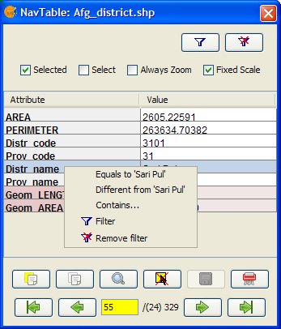

NavTable User Manual
********************

.. image:: images/picture_1.png
.. contents:: Index

0.- About the manual
====================

This document aims to offer general information about **NavTable** tool, which was created in order to work with tables belonging to vectorial layers on gvSIG. Next chapters of this document will explain the properties of the tool, its use, characteristics and main links.

Take into account that vectorial layers might be composed by several elements with spatial/geometric components (which are rendered in the view or map) plus alphanumeric information (which is represented in a table register as a collection of values).

Along this text register and element will be used as synonim of items (features) of a vectorial layer.

**Authors**:

- Fco. Alberto Varela García

- Juan Ignacio Varela García

- Javier Estévez Valiñas

- Pablo Sanxiao

- Francisco Puga

- Andrés Maneiro

- Jorge López

**Revisions**

.. parsed-literal::

  Revision 0.8: 24th February 2010
  Revision 0.6: 19th May 2010
  Revision 0.4: 18th September 2009
  Revision 0.2.2: 3rd June 2009
  Revision 0.2.1: 16th May 2009

Copyright 2009, 2010, 2011 - Cartolab http://www.cartolab.es
		      2011 - iCarto http://www.icarto.es

The document is distributed under Creative Commons version 3 license, which requires Attribution and Share Alike.
More information on: http://creativecommons.org/licenses/by-sa/3.0/en/

.. image:: images/picture_11.png

1.- Introduction
================

**NavTable** is a gvSIG extension to **display** in an agile way the alphanumeric elements of vectorial layers. It allows seeing the features of an element in a vertical table besides editing, navigating and quick filtering the values of a layer.

**NavTable** is released under a GPL v3 license. It has been created by **CartoLab**, the Cartographic Laboratory from University of A Coruña. Feel free to send us comments, suggestions, bug reports, etc.

1.1 Feature list:
^^^^^^^^^^^^^^^^^

1. Display data from vectorial layers in vertical align

2. Edit alphanumeric values (tested with ESRI Shapefile y PostGIS)

3. Navigate between elements: next, previous, ...

4. Allow to navigate only by selected elements

5. Zoom to the elements: manual and automatic

6. Allow zoom with fixed scale

7. Select and unselect elements

8. Copy attributes from last register or from selected

9. Create and drop elements

10. Length and area of a element is calculated

11. Available in several language: english, galician, spanish, portuguese, french, italian, german.

1.2 Tecnical nuts and bolts
^^^^^^^^^^^^^^^^^^^^^^^^^^^

NavTable was designed following a modular architecture, which allow to extend their functionalities in an easy way plus using it to display personalized forms. Its center panel is easily adaptable by injecting other forms to display, edit and even process the data. See next figure to learn the possibilities of this approach:

.. image:: images/picture_2.png

Bear in mind that the code of NavTable is publicly available for you to download and adapt it.

2.- Requirements
================

NavTable is cross-plaftform so can be installed in GNU/Linux, Windows and MacOS enviroments.

NavTable is a gvSIG extension, so it is necessary to have previously a gvSIG installation. It is compatible with versions 1.9 of gvSIG that can be obtained from  http://www.gvsig.org

More informaticon about gvSIG requirements:

- Minimum: Pentium III (or equivalent) / 256 MB RAM

- Recommended: Pentium IV (or equivalent) / 512 MB RAM

- Operating systems: Windows - Linux - Macintosh (Tested in WinXP, Linux Ubuntu 8.04/8.10 and Linux Kubuntu 7.10)

3.- Installation
================

Once gvSIG version 1.9 is installed in the system, NavTable can be installed with an installer or with a manual installation. First step is to download the installation files for Navtable. You can get them from: http://navtable.github.io/. Save the downloaded file in a folder.

3.1 Automatic installation:
^^^^^^^^^^^^^^^^^^^^^^^^^^^

Download the installer, execute it and follow the instructions.

3.2 Manual installation:
^^^^^^^^^^^^^^^^^^^^^^^^

For various reasons, it is often useful to have instructions for manual install an application. Here are the manual install steps for Navtable in Linux, Mac or Windows: download the binary files navTable_0.8.zip and unzip the folder 'es.udc.cartolab.gvsig.navtable' into: [gvSIG_installation_path]/bin/gvSIG/extensiones/

- **Linux example**:  /home/user/gvSIG_1.11/bin/gvSIG/extensiones/es.udc.cartolab.gvsig.navtable

- **Mac example**:   /home/user/gvSIG_1.11/bin/gvSIG/extensiones/

- **Windows example**: C:\Program Files\gvSIG_1_11\bin\gvSIG\extensiones\es.udc.cartolab.gvsig.navtable

4.- Working with NavTable
=========================

To activate NavTable you must select a vector layer in the gvSIG ToC (Table of Contents) and click the  button NavTable

.. image:: images/picture_6.png

NavTable interface has the following areas:

- **Top:** basic adjustments and filter checkboxes.

- **Central:** view and edit  data in each record.

- **Bottom:** navigate bar,  save button and others practical buttons.

NavTable can be used for editing and display alpha-numeric tables, which have no associated  geometry. For these  cases, NavTable  icon in the toolbar  will be blue.

.. image:: images/picture_8.png

The title of the  NavTable window for tables  without geometry has a '*' to distinguish it from normal tables.

4.1 Navigation
^^^^^^^^^^^^^^

NavTable scrolls through the records and features in a friendly way. You will find the navigation bar at the bottom of NavTable's window.

With these buttons you can:

- Go to the first record

- Go to the previous record

- Go to the next record

- Go to the last record

- Go  to any record using the box located between the  buttons described above. It  shows the number of the records you're currently viewing. If you enter a new value here you will see the corresponding record. Next to the position of the box there is a number indicating the total amount of records in the table.

If you are working in the central area of NavTable (click on any row) you can use the buttons “right”or “left”, “home” or “end” to change the record that you want to see.

4.1.1 Selecting elements
------------------------

If you click on the checkbox "selected" the navigation buttons will work only for features that are previous selected. If a feature is selected, the bottom area of the NavTable Window will be highlighted in yellow. In between parentheses the number of selected records can be seen next to the whole number of records.

.. image:: images/picture_21.png

In this image you see an example explaining how this function works: record 8 for a layer with 20 records is displayed  where 7 records are selected

If the checkbox "selected" is activated without any selected feature, all records will be shown empty and the box will not display any number.

.. image:: images/picture_22.png

The option "select" is another interesting tool you can find next to "selected" in the Nav Table menu. If you activate the checkbox next to  "select", the attributes you are visualizing will be selected and highlighted in the view. In the case that other features were selected, this option will turn them unselected and will select only the register you are visualizing.

On top of the NavTable Window there is the button "Filter"

.. image:: images/picture_14.png

If you press it, a dialogue window will appear in which you can define exactly what you want to select (attributes and calculations). If you click on "clear selection"

.. image:: images/picture_7.png

all selections will be turned off and no features will be selected.

4.1.2 Zoom to feature
----------------------
If you click on the zoom button

.. image:: images/picture_20.png

the feature will be displayed in the center of the view, referring to the record you are working with at that time. The scale of the view will be changed to have a good visualization of the data.

In case you are working with a point layer, a scale size will be chosen that allows to see also the surroundings of the point.

.. image:: images/picture_12.png

With help of the button "always zoom" next to the checkbox "select", Navtable will zoom to each feature referring to the record you are visualizing. If you click on "fixed scale" as well, Navtable will zoom to the feature and display it in the center of the view, but the scale will always remain the same.

It is possible to change the scale value introducing a new one in the "scale bar" of gvSIG. This is shown on the buttom right of the gvSIG view, next to where the coordinates are displayed.

**Tip:** The options "always zoom" or "fixed scale" together with "select" is a very interesting way of navigate through the features of a layer.

4.1.2 Quick filters
---------------------

Navtable offers you a comfortable way to make quick filters. If you want to use this functionality you must select a row in Navtable which has one of this attribute types: number, string or boolean. If you click on the right button of your mouse a new menu will be displayed which shows you the different options to define filters.

If the selected field is of type "string" one of the following options will be shown:

* **is the same than** [current text]
* **is different than** [current text]
* **contains...** (a new dialogue window will be displayed introducing text that Navtable should find between all other records)
* **Filter** (this option will call the "Filter" function of gvSIG as we have seen it before)
* **Clear Selection** (if a feature is selected)

If you want to use the quick filter of Navtable on a numeric field you will have these possibilities:

* **is the same than (==)** [current value]
* **is different than (!=)** [current value]
* **smaller than (<)** [current value]
* **greater than (<)** [current value]
* **filter**
* **clear filter**

.. image:: images/picture_25.png

regarding boolean fields the filter options are the followings:

* **equal to "TRUE"**
* **equal to "FALSE"**
* **filter**
* **clear fliter**

If there are selected records the "clear filter" option can be activated to delete the current selection. Each time you use Navtable´s quick filter option a new selection will be made and the actual one will be cleared.

Notice: You should consider that NavTable will show you an empty record if you use a filter and you have to activate the checkbox "selected". Every feature has the condition you are looking for including the expression you have defined for the filter.

Warning: if there is a great amount of records inside the table, the processing of the Navtable filter operations could take a long time (like in gvSIG filter itself). Please consider that there is a known bug in gvSIG when using filters with decimals in numerical fields and the "equal to" operator.

Filter for date fields have not yet been implemented in Navtable.

4.2 Edition
^^^^^^^^^^^

The main new functionality in Navtable is that you don't need to start the editing mode for a layer if you want to edit it. You should follow these steps to edit the table:

1. Make double click on the register you wish to work with (or click on the space bar). Now you are in editing modus and you will be able to modify this record.

2. Modify the data by entering a new value

3. Click on the "save" button

.. image:: images/picture_4.png

After that, the new value will be saved. It's important to consider these special cases if you want to save the edition:

- with boolean fields you can only use *true* or *false* (the expression is not case sensitive). If you enter another value, the record will be saved with the default value, false.

- If you try to save a value into a not appropriate field (for example from type „text“ into type „numerical“), the original value will be written.

- If you want to save an empty value, the default value will be saved. But if the field is from type „string“, the record will be saved with an empty text.

With Navtable it is also possible to use options for advanced editing. For example you can copy and paste records. For that you should select the record you want to copy first and click then on the button "copy selected feature".

 .. image:: images/picture_10.png

The data will be modified when you click on the button "save".

**Removing records**

It is possible to delete the record you are visualizing with Navtable if you click on the button "delete feature"

.. image:: images/picture_19.png

If this record has an associated geometry feature (graphical element), this one will be also deleted.

**Adding records to alphanumerical tables**

For tables which aren't associated to a layer, Navtable has this button

.. image:: images/picture_15.png

If you click on it, after the last one of the table a new record will appear.

4.3 Long names DBF
^^^^^^^^^^^^^^^^^^^

As you know, the dbf format doesn't allow field names with more than 10 characters. This limitation could be solved using alias for these fields. This option is also available for layers stored in a geodatabase.

If you wish to use this functionality you will need to create a text file with the same name as the layer in which you want to use "alias" names. Save this text file in the folder "alias" that was created when installing Navtable.

When installing gvSIG, a folder with the name gvSIG will also be created:

On **Windows** it is usually installed here  "C:\Documents and Settings\user\"

On **GNU/Linux** you will find it here: "/home/user/gvSIG"

When installing Navtable, a folder with the Name "Navtable" is saved to the "gvSIG" folders. At the Navtable folder you will find the "Alias" one, where you should save the text file mentioned above.

.. image:: images/picture_17.png

In this file you can define long names or alias for the field names.

 Name_original_field=long_name

It's only necessary to describe a row for the fields you want to define an alias name for. The order of the lines isn't important, that means, you don't need to follow the same sequence like the field's names of the table. Spaces are not allowed between the "=" sign and the name of the fields, but are allowed in the middle of the long name.

When Navtable is opened, the according "alias" text file will be found automatically. If new names for the fields are available there, Navtable will use these ones instead of the original names.

**Example:** There is a dbf file with the following fields:

.. image:: images/picture_26.png

We define an alias text file with the same name as the shape file: *Borde_mun.alias* in this case. In this file we will write the following text:

.. parsed-literal::

 cod_provinc=código de provincia
 cod_municip=código de municipio

This file *Borde_mun.alias* will be saved in the same folder as the file *Borde_mun.shp*. Now we can open the table of this layer with Navtable and can see the following:

**Important for Windows:**

Windows doesn't show the file extension by default. For this reason for a new alias text file the name of the file will be probably *name_layer.alias.txt* and Navtable will not be able to read this alias file.

In order to have a correct result for this functionality we recommend you to deactivate the option *hide hidden files and folders*. You can make this in Windows Explorer: *Extras > File Options > View > Advanced Settings > Hidden Files and Folders*

5.- More about NavTable
========================

NavTable is hosted by the github Forge[1]. On this page you can find useful information about the project and also related documents, mailing lists, bug reporting system, etc.

In the section "Future Work" on the project website you will find some of the things we want to incorporate in NavTable in the near future.

[1]: http://navtable.github.io/

6.- Collaboration
==================

NavTable is in a continuous development process, incorporating enhancements, fixing bugs, etc. Therefore, any suggestion, idea, comment, criticism or bug report is welcome.

You can collaborate in NavTable providing ideas, comments, reporting bugs, translating it to another language, etc. The way to do this is contact with the team through:

- **Email:** cartolab@udc.es

- **gvSIG Mailing lists:** http://www.gvsig.org/web/?id=listas-distribucion&amp%3bL=0&amp%3bK=1%252Findex.php%253Fid%253D-1%2520union%2520select--

- **BugTracker:** https://github.com/navtable/navtable/issues

Help us build a tool even more useful!

7 .- Credits
=============

CartoLab - Universidade da Coruña
http://www.cartolab.es/

**Director:** Fco. Alberto Varela García.

**Development Team:**

- Juan Ignacio Varela García

- Javier Estévez Valiñas

- Pablo Sanxiao Roca

- Francisco Puga Alonso

- Andrés Maneiro

Have contributed ideas, comments, suggestions, reported errors or translations:

- Francisco Alberto Varela García [C]

- Daniel Díaz Grandío [C]

- Gonzalo Martinez Crespo [C]

- Adrián Eiris Torres [C]

- Jorge Ocampo [iC]

- Carmen Molejón [iC]

- Juan Fuentes [C]

- Benjamin Ducke [OA]

- Agustín Diez Castillo [UV]

- Francisco José Peñarrubia [G]

- Joaquim Rocha

- Jordi Torres

- Artur Juen

- Silvio Grosso

- Antonio Falciano

- José Antonio Canalejo

.. parsed-literal::

  [C]: CartoLab
  [G]: gvSIG
  [OA]: Oxford Archaeology
  [UV]: Universitat de València
  [iC]: iCarto

License: GPLv3. You can see the terms of this license http://www.gnu.org/licenses
