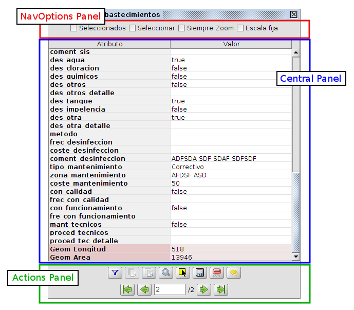
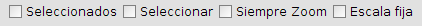
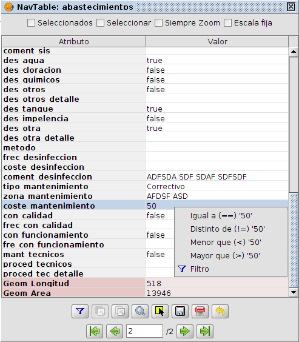
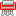
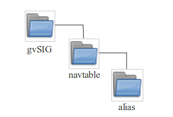
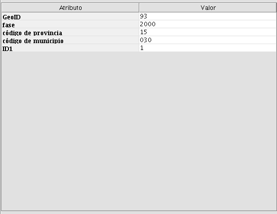

Manual básico de NavTable
*************************

.. contents:: Índice

0.- Acerca de este manual
==========================

En el presente documento tiene como finalidad ofrecer información sobre la herramienta **NavTable** creado para trabajar con las tablas asociadas a capas vectoriales en SIG libre gvSIG. En los apartados de este documento se describirán las propiedades de la herramienta, instrucciones de uso, características del proyecto NavTable y enlaces de interés.

Se debe tener en cuenta, para la correcta comprensión del documento, que en las capas vectoriales en un SIG suelen estar compuestas de muchos elementos que tienen una componente espacial/geométrica que se visualiza en la Vista o mapa y componentes alfanuméricos que se representan en un registro de una tabla o conjunto de valores.

A lo largo del texto se usará los términos  y  como sinónimos para referirse a los ítems (features) de una capa vectorial.

**Autores**:

- Fco. Alberto Varela García

- Juan Ignacio Varela García

- Javier Estévez Valiñas

- Pablo Sanxiao

- Francisco Puga

- Andrés Maneiro

- Jorge López

**Revisiones**

.. parsed-literal::

  Revisión 1.0: 18 de septiembre de 2013
  Revisión 0.8: 24 febrero 2010
  Revisión 0.6: 19 mayo 2010
  Revisión 0.4: 18 septiembre 2009
  Revisión 0.2.2: 3 junio 2009
  Revisión 0.2.1: 16 mayo 2009

Copyright 2009-2013 - Cartolab http://www.cartolab.es
		      2011-2013 - iCarto http://www.icarto.es

El presente documento se distribuye bajo la licencia Creative Commons versión 3 con Reconocimiento y Compartir igual.

Puede obtener más información sobre esta licencia en el siguiente enlace: http://creativecommons.org/licenses/by-sa/3.0/es/

.. figure:: images/picture_11.png

1.- Introducción
=================

**NavTable** es una extensión de gvSIG para **visualizar** de forma ágil registros de las capas vectoriales de información geográfica. Su principal característica es que permite ver los atributos de un elemento de manera individualizada en una tabla vertical. Entre sus funcionalidades cuenta con la posibilidad de editar los valores alfanuméricos, así como navegar entre los elementos de la capa de información.

**NavTable** es una herramienta pensada para mejorar la experiencia de los usuarios de SIG al manejar información alfanumérica, y resulta especialmente útil en el trabajo diario con este tipo de datos. NavTable permite navegar por tablas pudiendo visualizar y modificar datos de los registros existentes de forma ágil y sencilla.

**NavTable** se libera bajo una licencia GPL v3. Ha sido creada por el laboratorio **CartoLab** de la Universidade da Coruña. Animamos a cualquier usuario que nos haga llegar sugerencias, comentarios, informes de error, etc.

1.1 Listado de características:
^^^^^^^^^^^^^^^^^^^^^^^^^^^^^^^

1. Visualización de datos de capas vectoriales en registros individualizados y en sentido vertical

2. Edición de los valores alfanuméricos (testeado con ESRI Shapefile y PostGIS)

3. Acceso a registros contiguos, primero, último o de forma aleatoria.

4. Navegación usando filtros de selección

5. Zoom manual y automático a los elementos.

6. Zoom a los elementos con escala fija

7. Permite selección y deselección de elementos

8. Edición alfanumérica de los valores

9. Copiado de los atributos de un registro seleccionado

10. Creación y eliminación de registros.

11. Cálculo automático de la longitud y área de la geometría

12. Disponible en castellano, gallego, inglés y francés.

1.2 Aspectos técnicos
^^^^^^^^^^^^^^^^^^^^^
NavTable cuenta con un diseño interno modular, lo que permite programar nuevas formas de ver los datos alfanuméricos, manteniendo las funcionalidades y características generales de navegación de NavTable.

La parte central es fácilmente adaptable, lo que permite crear formularios personalizados, más complejos y con características avanzadas para visualizar, editar e incluso procesar los datos. En la siguiente figura, se muestra un ejemplo de este tipo de ampliaciones de NavTable:

Recuerde que el código fuente de NavTable se encuentra a su disposición en la página del proyecto.

2.- Requisitos
===============

NavTable es multiplataforma por lo que puede ser instalada en entornos Windows, GNU/Linux y MacOS.

Es necesario tener previamente una instalación de gvSIG en su rama 1.x (versión posterior a la 1.0, anterior a la 2), que se puede descargar desde http://www.gvsig.gva.es

Más información sobre requisitos de gvSIG:

- Mínimos: Pentium III (o equivalente) / 256 MB RAM

- Recomendados: Pentium IV (o equivalente) / 512 MB RAM

3.- Instalación
================

Una vez instalado gvSIG versión 1.x en el ordenador, se puede instalar la extensión NavTable usando un instalador automático o de forma manual. Todos los archivos necesarios se encuentran accesibles en la web  http://navtable.github.io/

3.1 Instalación automatizada mediante asistente
^^^^^^^^^^^^^^^^^^^^^^^^^^^^^^^^^^^^^^^^^^^^^^^

Descargar el instalador correspondiente a su sistema operativo y ejecutarlo. Seguir las instrucciones.

3.2 Instalación manual:
^^^^^^^^^^^^^^^^^^^^^^^

Si quiere instalar NavTable manualmente puede descargar el fichero de binarios navTable_0.8.zip y descomprimirlo en la ruta siguiente:

- Ejemplo en **Linux**:  /home/usuario/gvSIG_1.x/bin/gvSIG/extensiones/

- Ejemplo en **Mac**:  /home/usuario/gvSIG_1.x/bin/gvSIG/extensiones/

- Ejemplo en **Windows**: C:\\Archivos de programa\\gvSIG_1.x\\bin\\gvSIG\\extensiones\\

4.- Instrucciones de uso
=========================

Para activar NavTable es necesario tener seleccionada una capa vectorial en el ToC (listado de capas) dentro de gvSIG y pulsar el botón de NavTable

.. figure:: images/picture_6.png
	:width: 75 px

Alternativamente también se puede hacer click derecho sobre la capa en el ToC y seleccionar NavTable.

La interfaz gráfica de NavTable cuenta con las siguientes partes básicas:

- **Parte superior:** checkboxes de ajustes básicos de comportamiento y botón para crear filtros.

- **Parte central:** donde se visualizan y editan los datos de cada registro.

- **Parte inferior:** barra de navegación, botón de guardado y otros botones de manejo.

NavTable puede utilizarse para la edición y visualización de datos en tablas alfanúmericas puras, que no tengan asociada geometría. Para estos casos, cuando se tenga el foco en una tabla de estas características, el icono de NavTable en la barra de herramientas tiene un tono azul

El título de la ventana de NavTable para tablas sin geometría tiene un '*' para distinguirla de las tablas normales.

4.1 Navegación
^^^^^^^^^^^^^^

NavTable permite moverse entre los registros y elementos geométricos de modo muy simple. Para ello, en el panel inferior se encuentra la Barra de Navegación.

.. figure:: images/picture_16.png

Pulsando estos botones se puede:

- Ir al primer registro

- Ir al registro anterior

- Ir al siguiente registro

- Ir al último registro

- Ir a cualquier registro usando la caja de posición. Ésta muestra el número del registro que se está visualizando actualmente. Introduciendo una posición permite ver los valores del registro correspondiente. Al lado de la caja de posición se encuentra un número que indica el total de registros en la capa.

Si el foco está en la parte central de NavTable (haciendo click en alguna de las filas) se pueden usar las teclas del cursor (Derecha e Izquierda) para cambiar de registro, así como las teclas HOME y END para ir al primer o último registro respectivamente.

4.1.1 Selecciones
-----------------

En caso de que esté seleccionado el checkbox "Seleccionados" el comportamiento de estos botones de navegación varía limitando la navegación a registros de elementos que se encuentran seleccionados en el SIG. Cuando un elemento se encuentra seleccionado la caja de posición de el panel inferior de NavTable se pone de color amarillo. Además se indicará entre paréntesis el número de elementos que se encuentran seleccionados en esa capa junto al total de elementos de ésta.

.. figure:: images/picture_21.png

En la imagen superior se muestra un ejemplo en el que se visualiza el registro 8 de una capa que cuenta con 20 elementos de los cuales 7 están seleccionados.

En caso de activar la opción de "Seleccionados", pero existir ningún registro seleccionado todos los valores de los atributos se mostrarán vacíos y la caja de posición no indicará ningún número.

.. figure:: images/picture_22.png
	:width: 75 px

.. figure:: images/picture_18.png
	:width: 75 px

Este tipo de selección actúa sólo en el registro actual respetando el estado de la selección del resto de elementos.

Otro interesante comportamiento configurable en NavTable es la opción "Seleccionar" del checkbox del panel superior. Al activar esa opción el elemento que se está visualizando en NavTable siempre será seleccionado automáticamente en la vista. En caso de existir otros elementos seleccionados, se limpiará esa selección y se dejará seleccionado sólamente el elemento actual.

En el panel superior está el "botón de filtro" 

que permite construir consultas en gvSIG y obtener selecciones complejas de los elementos de la capa. Pulsando el botón de eliminar filtro 

 
se eliminan todas las selecciones.

4.1.2 Zoom al elemento
----------------------

Si se pulsa el botón de zoom

la vista asociada se centrará en la geometría del elemento que se está visualizando en NavTable en ese momento. La escala se ajusta para contener el elemento de la mejor forma posible. En el caso de ser una geometría de tipo punto, la escala toma un valor que permita ver el entorno al elemento puntual.

Si se activa la opción "Siempre Zoom" en el checkbox del panel superior, provocará que NavTable haga zoom extensión de forma automática al elemento mostrado cuando se pulsen los botones de navegación. En el caso de activar la opción "Escala fija", se centrará la vista dejando en el centro el elemento visualizado en NavTable, pero sin variar la escala actual de la Vista. La escala se puede ajustar cambiando su valor numérico en el checkbox de la parte inferior derecha de la Vista en gvSIG, junto a las coordenadas.

**Recomendación:** Las opciones de "Siempre Zoom" o "Escala fija" en combinación con la "Seleccionar" ofrecen una interesante forma de navegar por los elementos de una capa.

4.1.2 Filtros Rápidos
---------------------

Se pueden hacer filtros de forma muy cómoda usando NavTable. Para usar esta funcionalidad de filtros rápidos se debe seleccionar una única fila en NavTable que corresponda a un atributo de tipo numérico, texto o booleano. Al presionar el botón derecho de ratón, se desplegará un menú que mostrará algunas opciones básicas para hacer el filtrado.

Si el campo seleccionado es de tipo "texto" se mostrarán las siguientes opciones:

* **Igual a** [texto actual]
* **Distinto a** [texto actual]
* **Contiene...** (activará un diálogo para introducir la subcadena de texto a buscar entre todos los registros)
* **Filtro** (esta opción enlazaría con la extensión de filtrado de gvSIG, como en el panel superior)
* **Quitar filtro**

En el caso de activar el menú de filtro rápido sobre un atributo de tipo numérico, las opciones serían:

* **Igual a (==)** [valor actual]
* **Distinto de (!=)** [valor actual]
* **Menor que (<)** [valor actual]
* **Mayor que (<)** [valor actual]
* **Filtro** 
* **Quitar filtro** 

También existe la posibilidad de hacer filtros en los atributos booleanos donde las opciones disponibles serán:

* **Igual a "TRUE"**
* **Igual a "FALSE"**
* **Filtro** 
* **Quitar filtro** 

En el caso de que exista algún registro seleccionado, entre las opciones desplegadas en el menú estará la de "Quitar filtro" para limpiar la selección actual. De todos modos, al seleccionar un nuevo filtro rápido se elimina la selección actual automáticamente.

Nota: se debe recordar que en caso de tener activa la opción de "Seleccionados" de NavTable y si se hace un filtro donde no exista ningún registro que cumpla dicha condición, NavTable mostrará un registro vacío.

Advertencia: si el número de registros es muy elevado (al igual que sucede con la extensión de Filtro de gvSIG) las operaciones pueden llevar un tiempo de procesamiento importante. Otra cosa a tener en cuenta es que hay un error conocido en gvSIG al trabajar con filtros cuando el número es un decimal y la operación "Igual a". Los filtros para atributos de tipo fecha aún no han sido implementados.

4.2 Edición
^^^^^^^^^^^

La principal novedad que representa NavTable a la hora de editar datos es que no es necesario poner la capa en edición de antemano. Los pasos a seguir para modificar un atributo son:

1. Hacer doble click en una celda (o pulsar la barra espaciadora del teclado). Esto pondrá en edición esa celda poniendo un cursor preparado para escribir.

2. Modificar el dato con el nuevo valor.

3. Pulsar el botón de guardado 

.. figure:: images/picture_4.png
	:width: 75 px

Una vez hecho eso, el nuevo valor quedará registrado. Sin embargo, a la hora de salvar datos cabe destacar ciertos casos especiales:

- En el caso de que el tipo de dato sea un booleano, sólo se aceptarán los valores *true* o *false* (sin importar las mayúsculas/minúsculas). En caso de no ser ninguno de ellos, se mantendrá el valor por defecto, false.

- Igualmente en el caso de que se trate de guardar un tipo de dato incorrecto (por ejemplo un texto en un campo numérico), se mantendrá el valor inicial.

- Si se trata de guardar un campo sin valor, se guardará el valor por defecto que se haya asignado, salvo que el tipo de dato sea String, en el que se guardará como un texto vacío.

Además se dispone de un botón para edición rápida. Si se decide que el registro actual debe tener los mismos valores que otro registro existente, o comparte la mayoría de ellos, se puede seleccionar el registro que se desea copiar y pulsar el botón de copiar el registro seleccionado

para que se carguen automáticamente. También podemos copiar los valores del registro anterior con el botón

.. figure:: images/picture_28.png
	:width: 75 px

Sin embargo, no se modificarán los datos definitivamente hasta que se haga click en el botón de guardar.

**Eliminación de elementos**

Se puede eliminar el elemento actual que se está visualizando en NavTable mendiante el botón de eliminar registro 

En caso de que ese registro tenga geometría asociada esta será eliminada también.

**Deshacer cambios en el registro actual**

Podemos eliminar los cambios no guardados en el registro actual pulsando el botón

**Creación de registros en tablas alfanuméricas**

NavTable en modo de tabla alfanumérica sin geometría cuenta con el botón 

.. figure:: images/picture_15.png
	:width: 75 px

Pulsándolo es posible crear un nuevo registro a continuación del último registro.

4.3 Visualización de nombres largos
^^^^^^^^^^^^^^^^^^^^^^^^^^^^^^^^^^^

Como es de sobra conocido, el formato dbf no permite definir nombres para los campos de más de 10 caracteres. Esta limitación se puede corregir parcialmente con navTable, gracias al uso de alias para esos campos. Además de para los dbf esta función esta disponible también para capas cargadas desde una base de datos geoespacial.

Para ello es necesario definir un fichero de texto con el mismo nombre que tiene la capa, para la cual se quieren utilizar los alias, en el TOC de gvSIG y la extensión ".alias". Este fichero se debe guardar dentro de un directorio llamado alias que se crea cuando se instala NavTable. A continuación se detalla donde se encuentra este directorio.

Cuando se instala gvSIG, éste crea un directorio del mismo nombre dentro del directorio del usuario. En **Windows** típicamente se encuentra dentro de "C:\Documents and Settings\usuario\"

En **GNU/Linux** lo encontramos típicamente en el «home» del usuario, por ejemplo: "/home/usuario/gvSIG"

Dentro de este directorio, gvSIG, NavTable en el momento de instalarla, crea un directorio llamado NavTable y dentro de este otro llamado alias, que será donde se guardan los ficheros «.alias»

En este fichero se pueden definir nombres largos o alias para los nombres de los campos.

   Nombre_campo_original=Nombre_largo

Sólo es necesario escribir una línea con este formato para aquellos campos para los cuales se quiera definir un alias. El orden de estas líneas es libre, es decir, no es necesario seguir el orden de los campos en el fichero dbf. El nombre largo puede contener espacio, pero el igual que separa un campo de otro debe ir pegado a los caracteres, es decir no debe haber espacios entre el igual y los nombres de los campos.

Cuando se abre navTable, se comprueba si existe este fichero ".alias", si es así, para los campos que tienen definido un alias, se muestra éste en lugar del nombre original del campo.

**Ejemplo:** Tenemos un dbf con los siguientes campos:

.. figure:: images/picture_26.png
	:scale: 70 %

Definimos un fichero de alias con el mismo nombre del shp: *Borde_mun.alias* en este caso. En este fichero escribimos el siguiente contenido:

.. parsed-literal::

   cod_provinc=código de provincia
   cod_municip=código de municipio

Este fichero *Borde_mun.alias* lo guardamos en el mismo directorio que el fichero *Borde_mun.shp*. Ahora abrimos de nuevo la capa con navTable y vemos lo siguiente:

**Importante para Windows:**

Por defecto Windows oculta la extensión de los archivos, por lo que es probable que al crear un fichero de texto nuevo para los alias y lo guardamos con nombre  en realidad el nombre del fichero sea *nombre_capa.alias.txt*. Esto hará que navTable no sea capaz de leer el archivo de alias. Para asegurarse que esto no pasa es recomendable desactivar la opción *Ocultar las extensiones de archivo para tipos de archivo conocidos*. Esto puede hacerse a través del explorador de ficheros de Windows en el menú *Herramientas -- Opciones de carpeta*, en la pestaña *Ver*, dentro del apartado *Configuración avanzada*.

5.- Más información sobre NavTable
===================================

NavTable está alojado en la forja de github [1]. En esta página puedes encontrar información útil sobre este proyecto como documentos relacionados, listas de correo, sistema para informar de errores, etc.

En la sección de "Trabajos futuros" en página web del proyecto encontrarás algunas de las cosas que queremos incorporar próximamente en NavTable.

[1]: http://navtable.github.io/

6.- Colaboración
=================

NavTable se encuentra en proceso de desarrollo continuo, incorporando mejoras, corrigiendo fallos, etc. Por ello, todas las sugerencias, ideas, comentarios, críticas, notificación de errores serán bien recibidas.

Puedes colaborar en NavTable aportando ideas, comentarios, informando de errores, traduciendo a otro idioma, etc. Las vías para esto son las siguientes:

- **Correo electrónico:** cartolab@udc.es

- **Listas de correo del proyecto gvSIG:** `http://www.gvsig.org/web/?id=listas-distribucion &amp%3bL=0&amp%3bK=1%252Findex.php%253Fid%253D-1%2520union%2520select--`__

.. __: http://www.gvsig.org/web/?id=listas-distribucion&amp%3bL=0&amp%3bK=1%252Findex.php%253Fid%253D-1%2520union%2520select--

- **Reporte de errores:** https://github.com/navtable/navtable/issues

|

¡Ayúdanos a construir una herramienta todavía más útil!

7.- Créditos
=============

.. figure:: images/picture_13.png
	:width: 100px

CartoLab - Universidade da Coruña 
http://www.cartolab.es/

**Director:** Fco. Alberto Varela García.

**Equipo de desarrollo:**

- Juan Ignacio Varela García

- Javier Estévez Valiñas

- Pablo Sanxiao Roca

- Francisco Puga Alonso

- Andrés Maneiro Boga

- Jorge López Fernández

Han aportado ideas, comentarios, sugerencias y/o informado de errores:

- Francisco Alberto Varela García [C]

- Daniel Díaz Grandío [C]

- Adrián Eiris Torres [C]

- Vanessa Ros [C]

- Concepción Alonso [C]

- Gonzalo Martinez Crespo [iC]

- Jorge Ocampo [iC]

- Carmen Molejón [iC]

- Juan Fuentes [C]

- Benjamin Ducke [OA]

- Agustín Diez Castillo [UV]

- Francisco José Peñarrubia [G]

- Joaquim Rocha

- Jordi Torres

- Artur Juen

- Silvio Grosso

- Antonio Falciano

.. parsed-literal::

  [C]: CartoLab
  [G]: gvSIG
  [OA]: Oxford Archaeology
  [UV]: Universitat de València
  [iC]: iCarto

Licencia: GPLv3. Puede ver los términos de esta licencia en http://www.gnu.org/licenses
