Manuale introduttivo di NavTable
********************************

.. image:: images/picture_1.png

.. contents:: Indice

0.- Informazioni su questo manuale
==================================

Il presente documento vuole offrire informazioni sullo strumento NavTable creato per lavorare con le tabelle associate ai layer vettoriali nel GIS open source gvSIG. Nei capitoli di questo documento si descriveranno le proprietà dello strumento, le istruzioni per l'uso, le caratteristiche del progetto del progetto NavTable ed i collegamenti di interesse.

Bisogna considerare, per una corretta comprensione del documento, che i layer vettoriali in un GIS sono normalmente compsti da molti elementi che hanno una componente spaziale/geometrica che viene visualizzata nella Vista o nella Mappa ed elementi alfanumerici rappresentati nel record di una tabella o in un insieme di valori.

In questo documento saranno utilizzati i termini record o elemento come sinonimi per riferirsi alle entità geografiche (feature) di un layer vettoriale.

**Autori**:

- Fco. Alberto Varela García

- Juan Ignacio Varela García

- Javier Estévez Valiñas

- Pablo Sanxiao

- Francisco Puga

- Andrés Maneiro

La traduzione in lingua italiana del presente documento è stata realizzata da:

- Giuliano Ramat

- Silvio Grosso

- Antonio Falciano

- Associazione GISMAP www.gismap.it

**Revisioni**

.. parsed-literal::

  Revisión 0.8: 24 febbraio 2010
  Revisión 0.6: 19 maggio 2010
  Revisión 0.4: 18 settembre 2009
  Revisión 0.2.2: 3 giugno 2009
  Revisión 0.2.1: 16 maggio 2009

Copyright 2009, 2010, 2011 - Cartolab http://www.cartolab.es
		      2011 - iCarto http://www.icarto.es	

Questo documento è distribuito con la licenza Creative Commons Attribuzione-Condividi allo stesso modo 3.0 Italia.

Si possono ottenere maggiori informazioni riguardo questa licenza al seguente link: http://creativecommons.org/licenses/by-sa/3.0/it/

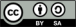

1.- Introduzione
================

**NavTable** è un'estensione di gvSIG che consente di consultare agevolmente la componente alfanumerica dei layer vettoriali. La sua caratteristica principale consiste nel permettere la visualizzazione degli attributi di ogni singolo record all'interno di una tabella verticale. Tra le sue funzionalità è possibile editare i valori alfanumerici, così come navigare tra le informazioni appartenenti agli elementi del layer.

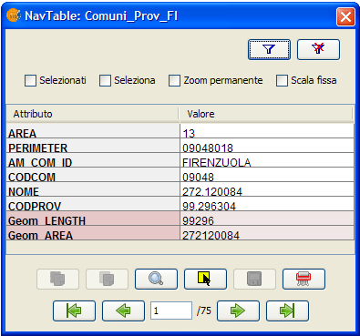

**NavTable** è uno strumento pensato per migliorare la gestione dell'informazione alfanumerica per gli utilizzatori del GIS, e risulta molto utile nel lavoro quotidiano con questo tipo di dati. NavTable permette di spostarsi nelle tabelle potendo visualizzare e modificare dati dei record esistenti in modo semplice e veloce.

**NavTable** è stata rilasciato con una licenza GPL v3. È stato creato dal laboratorio CartoLab della “Università di Coruña”. Tutti gli utenti sono invitati a far pervenire suggerimenti, commenti, messaggi di errori (bug), ecc.

1.1 Elenco delle funzionalità:
^^^^^^^^^^^^^^^^^^^^^^^^^^^^^^

1. Visualizzazione dei dati dei layer vettoriali in singoli record e in senso verticale

2. Editazione dei valori alfanumerici (testata con Shapefile ESRI e PostGIS)

3. Accesso a record contigui, primo, ultimo o distribuiti casualmente

4. Navigazione mediante l'utilizzo di filtri di selezione

5. Zoom manuale ed automatico degli elementi

6. Zoom degli elementi con scala fissa

7. Selezione e deselezione degli elementi

8. Editazione alfanumerica dei valori

9. Copia degli attributi del record selezionatoCopia degli attributi del record selezionato

10. Creazione ed eliminazione di record

11. Calcolo automatico della lunghezza e dell'area delle geometrie

12. Disponibile in castigliano, galiziano, inglese, francese e italiano.

1.2 Aspetti tecnici
^^^^^^^^^^^^^^^^^^^
NavTable è strutturata secondo un design interno modulare che permette di programmare facilmente nuove modalità di visualizzazione dei dati alfanumerici, mantenendo le funzionalità e le caratteristiche generali di navigazione di NavTable.

La parte centrale è facilmente adattabile, il che permette di creare formulari personalizzati, più completi e con caratteristiche avanzate per visualizzare, editare e personalizzare i dati.

Nella figura successiva è mostrato un esempio di una possibile personalizzazione di NavTable:

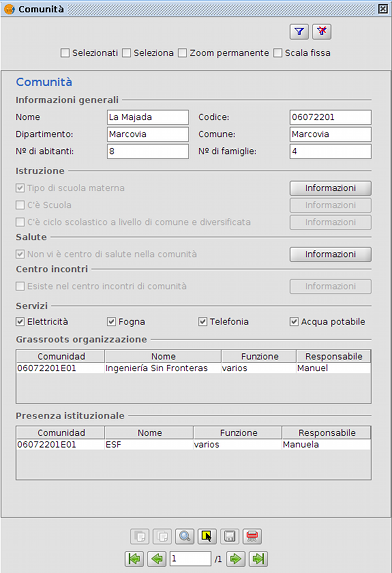

Si ricordi inoltre che il codice sorgente di NavTable è disponibile liberamente nella pagina web del progetto.

2.- Requisiti
=============

Navtable è multi piattaforma, di conseguenza può essere installata senza problemi su Windows, GNU/Linux e MacOS.

È necessario aver installato in precedenza gvSIG 1.11, che si può scaricare dalla pagina http://www.gvsig.org/web/projects/gvsig-desktop/official

Ulteriori informazioni sui requisiti di gvSIG:

- Mi­nimo: Pentium III (o equivalente) / 256 MB RAM

- Raccomandati: Pentium IV (o equivalente) / 512 MB RAM

3.- Installazione
=================

Appena installato gvSIG 1.11, è possibile procedere con l'installazione dell'estensione NavTable usando un installatore automatico oppure manualmente.

Tutti gli archivi con i file necessari si possono reperire liberamente nella pagina web http://forge.osor.eu/frs/?group_id=122

3.1 Installazione automatica mediante procedura guidata
^^^^^^^^^^^^^^^^^^^^^^^^^^^^^^^^^^^^^^^^^^^^^^^^^^^^^^^

Occorre scaricare l'installatore corrispondente al proprio sistema operativo ed eseguirlo. Successivamente, seguire le istruzioni.

3.2 Installazione manuale
^^^^^^^^^^^^^^^^^^^^^^^^^

Se si preferisce installare NavTable manualmente, è necessario scaricare il file compresso dei binari NavTable-0.8_gvSIG-1.11-bin.zip. Occorre poi decomprimerlo in base al proprio percorso di installazione di gvSIG:

- Esempio su Linux:  percorso_installazione_gvSIG/bin/gvSIG/extensiones/

- Esempio su Mac:  /home/utente/gvSIG_1.11/bin/gvSIG/extensiones/

- Esempio su Windows: C:\Programmi\gvSIG_1.11\bin\gvSIG\extensiones\

4.- Istruzioni d'uso
====================

Per attivare NavTable, occorre selezionare un layer all'interno della Tabella dei Contenuti (ToC) di gvSIG e cliccare sul pulsante di NavTable presente nella barra degli strumenti:

.. image:: images/picture_6.png

In alternativa, si può cliccare con il pulsante destro del mouse sul layer selezionato in precedenza e, nel menù contestuale che apparirà, selezionare l'opzione “Apri NavTable”.

L'interfaccia grafica di NavTable è costituita dalle seguente parti fondamentali:

- **Parte superiore**: contiene le caselle di controllo, che consentono di variare il comportamento dell'estensione, e i pulsanti per la definizione dei filtri;

- **Parte centrale**: consente la visualizzazione ed editazione dei dati alfanumerici appartenenti a ciascun record;

- **Parte inferiore**: è costituita da barra di navigazione, pulsante di salvataggio ed altri pulsanti con strumenti aggiuntivi.- **Parte inferior:** barra de navegación, botón de guardado y otros botones de manejo.

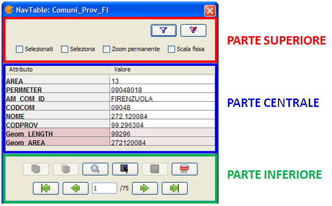

NavTable può essere utilizzata per l'editazione e la visualizzazione dei dati di tabelle alfanumeriche pure, cioè prive di geometria associata. In questi casi, selezionando una tabella con queste caratteristiche, l'icona del pulsante di NavTable nella barra degli strumenti assumerà un colore azzurro (anziché verde):

.. image:: images/picture_8.png

Il titolo della finestra di NavTable per tabelle senza geometria ha un '' per distinguerla dalle tabelle normali.

4.1 Navigazione
^^^^^^^^^^^^^^^

NavTable permette di spostarsi tra i record e le entità geometriche in modo molto semplice. A tal fine, nella parte inferiore di NavTable è presente un'apposita barra di navigazione.

.. image:: images/picture_16.png

Cliccando su questi pulsanti è possibile visualizzare:

- il primo record;
- il record precedente;
- il record successivo;
- l'ultimo record.
- è possibile, inoltre, visualizzare un qualsiasi record utilizzando la casella di posizione. Tale casella mostra la posizione del record attualmente visualizzato. Introducendo un valore di posizione consente di visualizzare i valori del record corrispondente. A lato della casella di posizione è indicato il totale dei record presenti nel layer in esame.

Se il cursore è posizionato nella parte centrale di NavTable (cliccando su una linea qualsiasi) si possono usare i pulsanti della tastiera (Destra e Sinistra) per cambiare record, così come i pulsanti Home e Fine per andare rispettivamente al primo o all'ultimo record.

4.1.1 Selezioni
---------------

Nel caso si attivi la casella di controllo “Selezionati” (1), il comportamento dei pulsanti della barra di navigazione varia, limitando la navigazione esclusivamente ai record degli elementi attualmente selezionati nella Vista di gvSIG (3). Quando si analizza un elemento selezionato, lo sfondo della casella di navigazione assume il colore giallo (2).

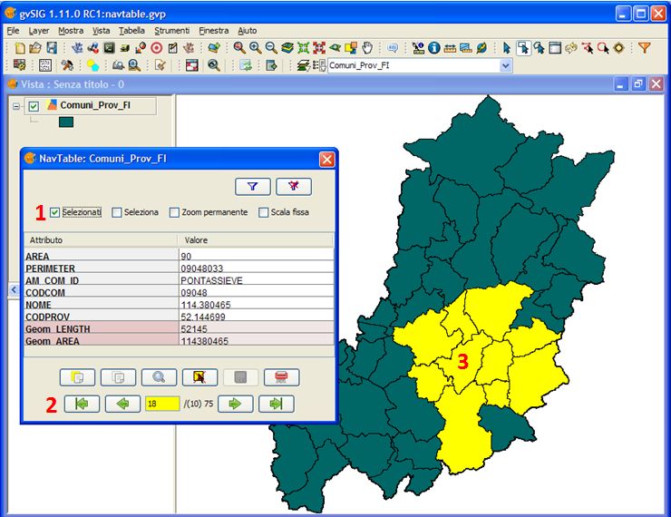

Inoltre sarà indicato in parentesi il numero degli elementi selezionati in quel layer seguito dal numero totale dei record dello stesso.

Nella immagine seguente si mostra un esempio nel quale si visualizza il record numero 18 di un layer di 75 elementi di cui 10 selezionati.

Nel caso che si attivi la casella di controllo “Selezionati”, senza che vi siano elementi selezionati, tutti i valori degli attributi saranno vuoti e la casella di posizione non indicherà nessun numero.

È possibile selezionare o deselezionare il record correntemente visualizzato utilizzando rispettivamente i seguenti pulsanti di selezione, lasciando inalterato lo stato di selezione del resto degli elementi.

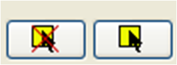

Un'altra interessante funzionalità presente in NavTable è l'opzione “Seleziona” (1) nel pannello superiore. Attivando tale casella di controllo, il record correntemente visualizzato in NavTable (2) avrà contemporaneamente la sua geometria selezionata nella Vista di gvSIG (3). Nel caso ci siano altri elementi selezionati, la selezione si annullerà lasciando selezionato unicamente l'elemento corrente.

.. image:: images/picture_14.png

Il pulsante “Filtro”, presente nella parte superiore di NavTable, 

.. image:: images/picture_27'.png

 permette di costruire richieste in gvSIG e ottenere selezioni complesse sugli elementi del layer. 
Premendo il pulsante Rimuovi filtro 

.. image:: images/picture_7.png

si eliminano tutte le selezioni.

4.1.2 Zoom su un elemento
--------------------------

Se si preme il pulsante di zoom

.. image:: images/picture_20.png

la vista collegata sarà centrata sulla geometria dell'elemento visualizzato in quel momento su NavTable. La scala si adegua per contenere l'elemento nella migliore maniera possibile. Se si tratta di una geometria puntuale, la scala assume un valore che permetta una visione nell'intorno dell'elemento puntuale.

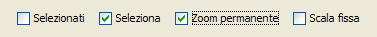

Se si attiva l'opzione "Zoom permanente" nella casella di controllo del pannello superiore, NavTable farà automaticamente uno zoom sull'elemento visualizzato quando si premono i pulsanti di navigazione.

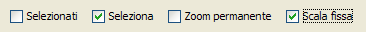

Nel caso si attivi l'opzione "Scala fissa", la vista sarà centrata sull'elemento visualizzato in NavTable, senza però variare la scala corrente della Vista. La scala si può anche modificare cambiando il suo valore numerico nella casella nella parte inferiore destra della Vista in gvSIG, accanto alle coordinate.

Nota: le opzioni “Scala fissa” e "Zoom permanente", usate in combinazione con “Selezionati”, garantisce una interessante forma di navigazione tra gli elementi del layer.

4.1.2 Filtri Rapidi
-------------------

Si possono effettuare filtri in maniera molto semplice usando NavTable. Per utilizzare questa funzione di filtri rapidi bisogna selezionare un'unica linea in NavTable che corrisponda ad un attributo di tipo numerico, testo o booleano. Premendo il pulsante destro del mouse, si visualizzerà un menù con lacune opzioni elementari per effettuare filtri.

Se il campo selezionato è di tipo "testo" si visualizzeranno le seguenti opzioni:

- **Uguale** a [testo corrente]

- **Diverso** da [testo corrente]

- **Contiene...** (attiverà una finestra di dialogo per scrivere la porzione di testo da cercare fra tutti i record)

- **Filtro** (questa opzione lancerà l'opzione di filtro di gvSIG, come nel pannello superiore)

- **Togliere** il filtro (Se è presente almeno un record selezionato)

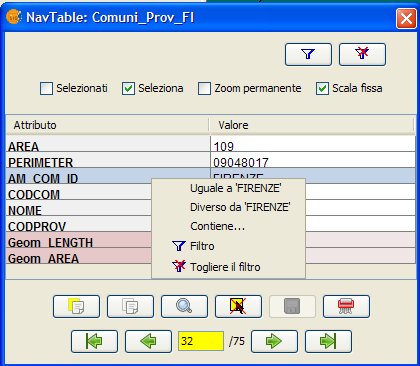

Se si attiva il menù di filtro rapido su di attributo ti tipo numerico, le opzioni saranno:

- **Uguale a** (==) [valore corrente]

- **Diverso da** (!=) [valore corrente]

- **Minore di** (<) [valore corrente]

- **Maggiore di** (<) [valore corrente]

- **Filtro** 

- **Togliere il filtro** 

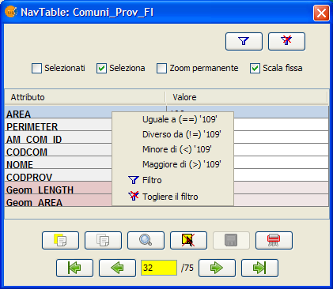

Esiste inoltre la possibilità di effettuare filtri su attributi di tipo boleano dove le opzioni disponibili saranno:

- Uguale a "TRUE"

- Uguale a "FALSE"

- Filtro 

- Togliere il filtro 

Nel caso ci siano dei record selezionati, fra le opzioni visualizzate nel menù sarà presente "Togliere il filtro" per rimuovere la selezione corrente. In tutti i casi, effettuando un nuovo filtro rapido si elimina automaticamente la selezione corrente.

Nota: Bisogna ricordare che se l'opzione "Selezionati" di NavTable è attiva e si effettua un filtro che non sia soddisfatto da nessun record, NavTable mostrerà un risultato vuoto.

Nota: Se il numero dei record è molto alto (così come succede con l'estensione Filtro in gvSIG) le operazioni possono richiedere un tempo di elaborazione lungo. Un altro aspetto da considerare è che esiste un errore conosciuto in gvSIG quando si lavora con i filtri con un numero decimale e l'operazione "Uguale a". I filtri per attributi di tipo data non sono stati sviluppati.

4.1.3 Calcolo automatico della lunghezza e dell'area
-----------------------------------------------------

NavTable visualizza in automatico la lunghezza (Geom LENGTH) e l'area (Geom AREA) delle geometrie appartenenti al layer selezionato, pur non essendo tali campi effettivamente presenti nella tabella degli attributi associata.

4.2 Editazione
^^^^^^^^^^^^^^^

La novità principale rappresentata da NavTable quando si editano dati è che non è necessario mettere precedentemente il layer in editazione. I passi da seguire per modificare un attributo sono:

1. Fare doppio click su una cella (o premere la barra spaziatrice della tastiera). Questo metterà in editazione questa cella mostrando un cursore pronto per la scrittura.

2. Modificare il dato con il nuovo valore.

3. Cliccare sul pulsante “Salva”

.. image:: images/picture_4.png

Una volta salvato, il nuovo valore sarà registrato. Tuttavia, all'atto del salvataggio dei dati possono verificarsi alcune situazioni particolari:

- Nel caso in cui il tipo di dato sia booleano, saranno accettati esclusivamente i valori true e false (a prescindere dalle maiuscole o minuscole). Qualora non sia utilizzato nessuno dei due, sarà mantenuto il valore precedente.

- Analogamente, quando si cerca di salvare un tipo di dato scorretto (ad esempio, un testo in un campo numerico), sarà mantenuto il valore precedente.

- Se invece si tenta di salvare una cella vuota, sarà salvato il valore predefinito che è stato assegnato, ad eccezione del caso in cui il dato sia di tipo String, in cui sarà salvata la cella vuota.

**Copiare un elemento**

Inoltre, è presente un apposito pulsante per l'editazione rapida. Se si decide che il record visualizzato deve contenere gli stessi o la maggior parte dei valori di quello che lo precede, è possibile cliccare sul pulsante “Copia il record precedente”

 .. image:: images/picture_10.png

affinché tali valori siano copiati automaticamente. Per rendere le modifiche definitive è  necessario cliccare sul pulsante “Salva” di NavTable.

**Eliminare un elemento**

È possibile eliminare il record selezionato, così come la geometria ad esso associata, cliccando sull'apposito pulsante presente in NavTable:

.. image:: images/picture_19.png

Nel caso che questo elemento abbia una geometria associata, anche questa sarà eliminata.

**Creazione di record in tabelle alfanumeriche**

Nelle tabelle alfanumeriche senza alcuna geometria associata, è possibile aggiungere un record in coda alla tabella stessa cliccando sul pulsante “Nuovo record”:

.. image:: images/picture_15.png

Tale pulsante è visibile esclusivamente nel caso di tabelle senza geometrie associate.

4.3 Visualizzazione di nomi di campi molto lunghi
^^^^^^^^^^^^^^^^^^^^^^^^^^^^^^^^^^^^^^^^^^^^^^^^^^

Come è noto, il formato dbf non permette la definizione di nomi dei campi con più di 10 caratteri. Tale limitazione, tuttavia, può essere aggirata almeno in parte con NavTable definendo gli “alias” per questi campi. Inoltre questa funzione è disponibile anche per layer caricate a partire da un geodatabase.

A tal fine, è necessario creare un file di testo, avente lo stesso nome del layer per il quale si vuole utilizzare gli alias nel TOC di gvSIG, ed estensione “.alias”. Questo file si deve salvare in una cartella chiamata alias che si crea quando si installa NavTable. 

La cartella alias si trova:

In Windows normalmente si trova in “C:\Documents and Settings\Utente\gvSIG\navTable”

.. image:: images/picture_9.jpg

In GNU/Linux si trova di solito nella «home» dell'utente, per esempio: "/home/utente/gvSIG"

In questa cartella gvSIG, NavTable durante la sua installazione crea una cartella chiamata NavTable ed al suo interno un'altra chiamata alias, che sarà dove saranno salvati i files «.alias»

.. image:: images/picture_17.png

In questo file è possibile definire nomi di campi di lunghezza superiore a 10 caratteri, ovvero gli alias.

Nome_campo_originale=Nome_lungo

È necessario scrivere una riga di testo con questo formato per tutti i campi per i quali si desidera utilizzare un alias. L'ordine di definizione degli alias è libero, pertanto non è necessario seguire lo stesso ordine dei campi del file dbf.
Appena si apre NavTable, l'estensione verificherà se esiste o meno questo file “.alias”. In caso affermativo, per tutti i campi per i quali è stato definito un alias sarà mostrato 

Esempio: Consideriamo un dbf con i seguenti campi:

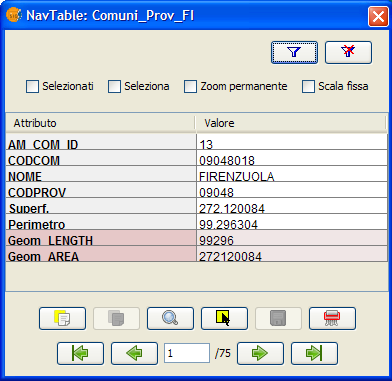

Definiamo un file degli alias con lo stesso nome del layer shp: firenze_am_com_poly.alias in questo caso. All'interno di questo file di testo scriviamo ad esempio:

.. parsed-literal::

   cod_provinc=Codice del Comune
   cod_municip=Codice della Provincia

Il file firenze_am_com_poly.alias deve essere salvato nella stessa cartella in cui è presente il file reg2008.shp. Aprendo di nuovo il layer con NavTable, si avrà:

.. image:: images/picture_5.png

**Importante per gli utenti Windows:**

Per impostazione predefinita, Windows nasconde le estensioni dei file e pertanto è possibile che, creando un nuovo file di testo contenente gli alias e salvandolo come nome_layer.alias, questo sia salvato in realtà come nome_layer.alias.txt. Di conseguenza, NavTable non sarà in grado di interpretare tale file come un file di alias. Per assicurarsi che ciò non accada, è necessario disattivare la casella di controllo “Nascondi le estensioni per i tipi di file conosciuti”, presente nelle “Impostazioni avanzate”. Per effettuare tale modifica, occorre recarsi in “Esplora risorse” e cliccare sul menù “Strumenti”, “Opzioni cartella”, scheda “Visualizzazione”.

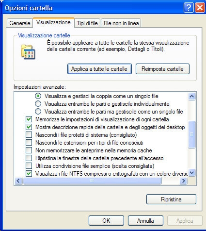

5.- Maggiori informazioni su NavTable
=======================================

NavTable è disponibile presso la pagina web del OSOR [1]. In questa pagina è possibile ottenere informazioni utili su questo progetto come documenti, relazioni, mailing list, bug tracker, ecc. 
Nella sezione “Roadmap” della stessa pagina web del progetto è possibile sapere quelle che saranno le nuove funzionalità che saranno implementate in futuro in NavTable

[1]:  http://navtable.forge.osor.eu/

6.- Collaborazione
===================

NavTable è attualmente in pieno sviluppo, sono continuamente aggiunte nuove funzionalità, sono corretti gli errori di programmazione, ecc. Per questo motivo tutti i suggerimenti, idee, commenti, segnalazioni di errori sono ben accetti.

E' possibile collaborare con il team di NavTable apportando idee, commenti, segnalazioni di errori, traduzioni in altre lingue, ecc. A tal fine, gli strumenti principali sono:

- Posta elettronica: cartolab@udc.es

- Mailing list del progetto gvSIG: http://www.gvsig.org/web/home/community/mailing-lists

- Segnalazioni di errori: http://forge.osor.eu/tracker/?atid=462&amp;group_id=122&amp;func=browse

Aiutateci a rendere NavTable ancora migliore!

7.- Crediti
=============

.. image:: images/picture_13.png

CartoLab - Universidade da Coruña 
http://www.cartolab.es/

**Direttore:** Fco. Alberto Varela García.

**Gruppo di sviluppatori:**

- Juan Ignacio Varela García

- Javier Estévez Valiñas

- Pablo Sanxiao Roca

- Francisco Puga Alonso

- Andrés Maneiro

Le seguenti persone hanno apportato idee, commenti, suggerimenti e segnalazioni di errori:

- Francisco Alberto Varela García [C]

- Daniel Díaz Grandío [C]

- Gonzalo Martinez Crespo [C]

- Adrián Eiris Torres [C]

- Jorge Ocampo [iC]

- Carmen Molejón [iC]

- Juan Fuentes [C]

- Benjamin Ducke [OA]

- Agustín Diez Castillo [UV]

- Francisco José Peñarrubia [G]

- Joaquim Rocha

- Jordi Torres

- Artur Juen

- Silvio Grosso

- Antonio Falciano

.. parsed-literal::

  [C]: CartoLab
  [G]: gvSIG
  [OA]: Oxford Archaeology
  [UV]: Universitat de València
  [iC]: iCarto

Licenza: GPLv3. Si possono leggere i termini di questa licenza su http://www.gnu.org/licenses
